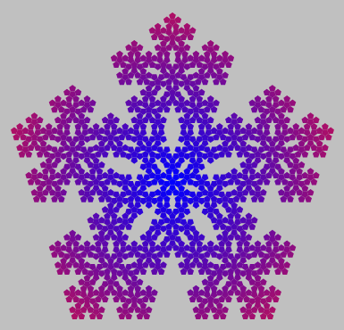

====================================================
Art with Asterius 
====================================================

Asterius compiles Haskell code into WebAssembly code to be executed in a browser
or in Node.js. It has reached a new milestone by being able to compile
``diagrams`` library and its dependencies.

Asterius has seen a lot of contributions in the past few months. Big kudos to
Tweag I/O for sponsoring Cheng Shao and to IOHK for sponsoring Sylvain Henry to
work on this project.

In the first part of this post we explain how to run an example from scratch.
Please try it and provide any feedback you may have. The second part of this
post gives more technical details about what we have been working on.

Diagrams example
----------------

Suppose we want to generate and display some SVG directly in the browser with
``diagrams``. First, we select an example in the `gallery
<https://diagrams.github.io/gallery>`_ (e.g. we chose `Pentaflake
<https://diagrams.github.io/gallery/Pentaflake.html>`_).
To use it with Asterius, we just have to adapt the provided code as follows.

First we have some pragmas and imports:

.. code:: haskell

   {-# LANGUAGE FlexibleContexts #-}
   {-# LANGUAGE TypeFamilies #-}

   import Diagrams.Backend.SVG
   import Diagrams.Prelude
   import Asterius.Types

Then ``pentaflake`` is the function generating the diagram that we have taken
from the gallery:

.. code:: haskell

   pentaflake :: Int -> Diagram B
   pentaflake i = pentaflake' i # fillTexture grad # bgFrame 4 silver
      where
         grad = defaultRG & _RG . rGradStops .~ mkStops [(blue,0,1), (crimson,1,1)]
                          & _RG . rGradRadius1 .~ 50
         pentaflake' 0 = regPoly 5 1 # lw none
         pentaflake' n = appends
                           pCenter
                           (zip vs (repeat (rotateBy (1/2) pOutside)))
           where vs = iterateN 5 (rotateBy (1/5))
                    . (if odd n then negated else id)
                    $ unitY
                 pCenter  = pentaflake' (n-1)
                 pOutside = pCenter

Then ``showSVG`` is defined as some fragment of JavaScript code that will be
executed in the browser. It's an IIFE (immediately invoked function expression)
that appends a ``div`` element with the given contents to the page body.

.. code:: haskell

   foreign import javascript
      "function () {                                \
      \   const d = document.createElement('div');  \
      \   d.innerHTML = ${1};                       \
      \   document.body.appendChild(d);             \
      \}()"
      showSVG :: JSString -> IO ()

Finally ``main`` uses standard ``diagrams`` code to generate an SVG file as a
``String``. It calls ``showSVG`` to display the element in the browser.

.. code:: haskell

   main :: IO ()
   main = do
      let
        opts = SVGOptions
           { _size            = dims2D 400 400
           , _svgDefinitions  = Nothing
           , _idPrefix        = mempty
           , _svgAttributes   = []
           , _generateDoctype = False
           }
        svg = renderDia SVG opts (pentaflake 4)
      showSVG (toJSString (show svg))

Now let's see how to compile and test this code. First we need to install Asterius:

.. code:: bash

   > git clone https://github.com/tweag/asterius.git
   > cd asterius
   > stack install # this needs stack, cmake, Node.js (npm), etc.
   ... long building time

The last command installs some executables in ``~/.usr/local/bin``:
``ahc-cabal``, ``ahc-dist``, etc. The next step is to boot
Asterius, that is to install several common packages (base, ghc-prim, etc.):

.. code:: bash

   > ahc-boot # be sure that ~/.usr/local/bin is in your $PATH
   ... long building time

Then we can install the dependencies we need with ``ahc-cabal``. We just have to
write the following ``pentaflake.cabal`` file (``Pentaflake.hs`` is our Haskell
file defined above):

.. code::

   cabal-version: 1.24

   name:           pentaflake
   version:        0.0.1
   license:        BSD3
   build-type:     Simple

   executable pentaflake
     main-is: Pentaflake.hs
     ghc-options: -Wall
     build-depends:
           base
         , text
         , diagrams
         , diagrams-svg
         , diagrams-lib
         , svg-builder
         , asterius-prelude
         , lucid-svg
     default-language: Haskell2010

To build our ``pentaflake`` program and all of its dependencies we just have to
type:

.. code:: bash

   > ahc-cabal new-install pentaflake --symlink-bindir web

``ahc-cabal`` is a wrapper for ``cabal-install``, so you need to have it
installed.

Finally we need to setup the program in a distributable form. This is done
with the ``ahc-dist`` program as follows:

.. code::

   > ahc-dist --browser --input-hs web/pentaflake.hs

   [INFO] Compiling Pentaflake.hs to WebAssembly
   [INFO] Converting linked IR to wasm-toolkit IR
   [INFO] Writing WebAssembly binary to "web/pentaflake.wasm"
   [INFO] Writing JavaScript runtime modules to "web"
   [INFO] Writing JavaScript loader module to "web/pentaflake.wasm.mjs"
   [INFO] Writing JavaScript req module to "web/pentaflake.req.mjs"
   [INFO] Writing JavaScript entry module to "web/pentaflake.mjs"
   [INFO] Writing HTML to "web/pentaflake.html"

The ``--browser`` flag indicates that we want to target a browser instead of
Node.js. To test the program in a browser, just use a Web server. For instance
with ``warp`` (from the ``wai-app-static`` package):

.. code::

   > warp -d web &
   Serving directory [...] on port 3000 with ["index.html","index.htm"] index files.

   > firefox "localhost:3000/pentaflake.html"

After a few seconds, your browser should display the following image:

Technical details
-----------------

To support the example above and many other codes, a lot of things have been
implemented into Asterius in the past months:

* ``template-haskell``: TH support has been added. Splices are compiled and
  executed via a remote GHCi process (a.k.a. ``iserv``) that uses Node.js. This
  was a huge roadblock as many packages use template-haskell, compiler
  annotations (e.g. for HLINT), or rely on packages using them. 

* multi-thread scheduler: Asterius now uses a thread scheduler closer to the
  native one. It supports cooperative scheduling of several threads, timers
  (``threadDelay``), MVars, etc.

* Cabal custom setup: better support for Cabal projects with custom build-type
  (i.e. that use custom ``Setup.hs`` build programs).

* ahc-cabal: a lot more packages can be built with ``ahc-cabal`` (our
  ``cabal-install`` wrapper) thanks to the changes above. It means that we have
  much less packages to modify and distribute as boot packages as ``ahc-boot``
  now uses ``ahc-cabal`` to install them. We will also distribute a Docker image
  with as many packages from a Stackage snapshot as we can.

* performances: a great advantage of examples running in the browser is that we
  can use their integrated debugging tools. In particular it helped us detect
  that programs were spending too much time in the garbage collector. We fixed
  it and performances are now much more acceptable.
