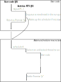
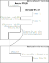

================================================================
WIP: Cooperative multi-threading
================================================================

The RTS maintains a list of TSOs. The runnable ones are in a run-queue. Calling
into Haskell code isn't synchronous and returns a Promise:

Each time a TSO calls back into the scheduler (using an RTS primitive or a FFI
call), the latter can put the TSO back into the Capability queue (or in the
run-queue) and may schedule another runnable TSO from the run-queue.

More specifically, safe FFI calls are implemented as follows:

