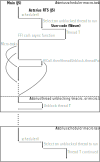

================================================================
WIP: Cooperative multi-threading
================================================================

The RTS maintains a list of TSOs in the Capability. The runnable ones are in a
run-queue. Calling into Haskell code isn't synchronous and returns a Promise.

Each time a TSO calls back into the scheduler, the latter can put the TSO back
into the Capability queue (or in the run-queue) and may schedule another
runnable TSO from the run-queue.

The FFI is made reentrant and non-blocking as follows:

