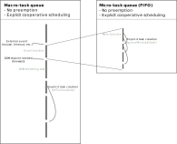

================================================================
JavaScript execution model
================================================================

JS engines maintain a set of tasks. Among them, the runnable tasks are in a
queue (macro-task queue). Each task of the queue is executed until its
completion without any kind of preemption. A long running task may "block" the
execution of other tasks. This is especially noticeable in a Web browser when
the DOM rendering task and the UI event handler tasks are blocked.

Each task is in fact composed of a queue of "micro-tasks". Initially there is a
single micro-task in the queue. This task can queue other micro-tasks with
``queueMicrotask(task)``. These micro-tasks are executed in FIFO order. When the
micro-task queue is empty, the macro-task has completed.

----------------------------------------------------------------
Promises
----------------------------------------------------------------

`Promises
<https://developer.mozilla.org/en-US/docs/Web/JavaScript/Reference/Global_Objects/Promise>`_
are JS synchronization objects. When they settle they can either be fulfilled or
rejected.

.. code:: js

   p = new Promise((resolve,reject) => whatever)

``whatever`` is executed synchronously. ``resolve`` and ``reject`` are functions to set the Promise value.

.. code:: js

   p.then(r => doSomething)
   p.catch(r => doSomething)

``doSomething`` is always executed asynchronously.

In a micro-task we detect if ``p`` is settled: if it is, we execute ``doSomething``,
otherwise ``doSomething`` will be executed in a future macro-task (when ``p`` gets
settled)

.. code:: js

   b = p.then(f).then(g)

is equivalent to:

.. code:: js

   a = p.then(f)
   b = a.then(g)

so we queue several micro-tasks in order just like before. If we only have
settled Promises, the execution is very fast as no macro-task creation/switching
occurs.

``Promise.all(xs)`` waits for all the promises to settle.
``Promise.race(xs)`` returns the first settled Promise in xs (eiter resolved or rejected)

With ES2017 we can somewhat replace Promises with
`await/async <https://developer.mozilla.org/en-US/docs/Web/JavaScript/Reference/Operators/await>`_:

.. code::

   async function (x,y) {
      try {
         let a = await p
         let b = await (f a)
         ...
      } catch(errhandler)
   }

* ``await`` can only be used in an ``async`` function
* ``await p`` creates a delimited continuation ``c`` so that ``p.then(c)``

----------------------------------------------------------------
Workers
----------------------------------------------------------------

JS supports some kind of multi-threading via
`Workers <https://developer.mozilla.org/en-US/docs/Web/API/Web_Workers_API>`_. A
Worker has its own task queues and execution engine. Each worker has its own JS
context and Workers are executed concurrently (e.g. one OS thread per Worker).

Communication between Workers is done via message passing. It is also possible
to use shared memory via a
`SharedBufferArray <https://developer.mozilla.org/en-US/docs/Web/JavaScript/Reference/Global_Objects/SharedArrayBuffer>`_.
Note: some JS engines have disabled it for security reasons. At the time of
writing, it is available in Node and the latest versions of Chrome.

----------------------------------------------------------------
Wasm threads
----------------------------------------------------------------

There is a
`proposal <https://github.com/WebAssembly/threads/blob/master/proposals/threads/Overview.md>`_
to add support for threads in WebAssembly reusing Worker and SharedBufferArray
but it isn't implemented yet.

